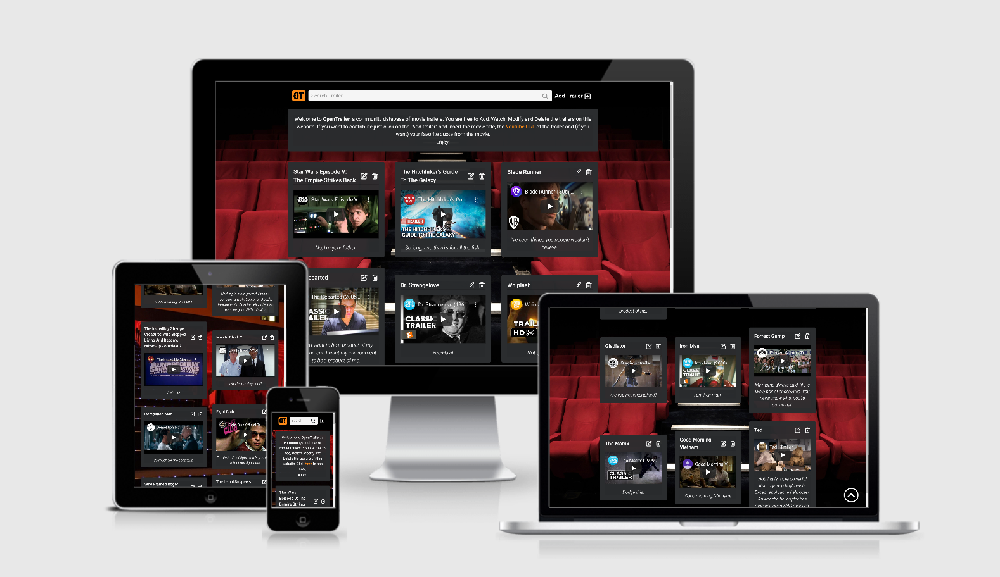

# [Open Trailer](https://open-trailer.herokuapp.com/)

An open database for movie trailers.



## Table of Contents
1. [**UX**](#ux)
    - [**Project Goals**](#project-goals)
    - [**User Goals**](#user-goals)
    - [**Developer Goals**](#developer-goals)
    - [**User Stories**](#user-stories)
    - [**Design Choices**](#design-choices)
    - [**Wireframes**](#wireframes)

2. [**Features**](#features)
    - [**Existing Features**](#existing-features)
    - [**Features Left to Implement**](#features-left-to-implement)
    - [**Removed Features**](#removed-features)

3. [**Technologies Used**](#technologies-used)

4. [**Testing**](#testing)
    - [**Tested Devices**](#tested-devices)
    - [**Laptop Testing**](#laptop-testing)
    - [**Smartphone Testing**](#smartphone-testing)
    - [**Validation Services**](#validation-services)
    - [**Bugs Discovered**](#bugs-discovered)

6. [**Deployment**](#deployment)
    - [**How to run this project locally**](#how-to-run-this-project-locally)

7. [**Credits**](#credits)
    - [**Code**](#code)
    - [**Media**](#media)
    - [**Acknowledgments**](#acknowledgments)

8. [**Disclaimer**](#disclaimer)

## UX

### User Goals

The main target audience for Open Trailer are english speaking people with a passion for movies.

User goals are:

- Find a new movie to watch.
- Rediscover a movie that I had forgotten.
- Share my favorite movies with people with my same passion.
- Update trailers already present in the database by adding a quote or choosing a higher quality video.
- Eliminate incorrect or offensive content.

Open Trailer meets these needs by:

- Allowing the user to easily browse the database, by searching for a movie title or simply scrolling down the page.
- Being easy to use, as the operations of creating, modifying, and eliminating are all handled in a very similar way so that the user has to learn how to do it only once.
- Having a clear and elegant user interface that allows a smooth navigation flow.

### Developer Goals

- Improve the ability to create responsive design websites through the mobile-first approach.  
- Improve the ability to make a website interactive using JavaScript and jQuery.  
- Learn how to create and handle NoSQL databases.
- Learn how to connect a database to a website using Python and Flask.  
- Add a functional and visually attractive website to the developer portfolio.

### User Stories  

### Design Choices  

#### Fonts  
All fonts are from [Google Fonts](https://fonts.google.com/).  
- _Roboto_: Site main font, it was chosen for its clear and straight design.  
- _Piedra_: Used to create the logo, it was chosen for its uniqueness.

#### Icons  
All icons are from [Feather Icons](https://feathericons.com/).  
- _CRUD Operations_: Icons are used to manage database operations, with easily recognizable images often used on sites of this type. For example the magnifying glass for "search" and the trash can for "delete".
- _Navigations Buttons_: Icons have also been added to navigation buttons as visual clues to facilitate site navigation.
  
#### Colors  
Since the site is a collection of trailers, it mainly uses dull colors in order to emphasize the trailer previews. 
- _Off-Black (#2B2D2F)_: Used as background color for the trailer cards.
- _Off-White (#f5f5f5)_: Used as main text color.
- _LIght gray (#999)_: Used for input placeholders and icons.
- _Bright Orange (#D35400)_: The only bright color, is used to highlight key elements such as the logo and the buttons when the user hovers them with the mouse.  

### Wireframes  
  
The wireframes were created using [Figma](https://www.figma.com/) and can be found [here](https://www.figma.com/file/Zy7VgngJfOWds4nafWafJI/Third-Milestone-Project?node-id=0%3A1).

## Features

### Existing Features  

#### Navbar
- _Website Logo_: If clicked, it takes the user back to the home page.
- _Search Bar_: Allows the user to search the database using movie titles as search keys.  
- _Add-trailer Button_: Manage the "Create" operation by loading the appropriate modal, The button text disappears if the user accesses the site from a smartphone in order to leave more space for the search bar.

#### Site Description
- _Introduction_: Briefly explain how the site works, the introduction text is slightly longer if the user accesses the site from a laptop or desktop in order to take advantage of the larger screen space.
- _How-to-url.gif_: For the less tech-savvy users, the most complex part of creating a trailer is to copy and paste the Youtube URL. This gif shows how to do it in a few simple steps.
  
#### Trailer Cards
The content of the database is shown to the user through a list of cards contained in a bootstrap grid, each card has the following content:
- _Movie Title_: In bold, in the card header.
- _Card Buttons_: Manage the "Update" and "Delete" operations by loading the respective modals.
- _Youtube Video_: Are responsive and automatically adapt to the screen size.
- _Movie Quote_: In italics, in the card footer

#### Add/Edit-Trailer Modal
The "Create" and "Update" operations are managed by the same modal whose attributes are modified by JS functions each time the user clicks on the appropriate button. This has 2 advantages:
- _Fast updating_: Adding or modifying a feature to the modals is a one-time operation, saving time and reducing the risk of making mistakes.
- _Consistency_: Since the two modals are almost identical, the user only needs to learn once to manage both operations (Create and Update).

The input fields present in the modal are the following:
- _Movie Title_: All the words of the inserted text are capitalized by the `string.capwords()` python method, returning an appropriate format for a movie title. This field can contain a maximum of 85 characters, and a message warns the user if the maximum number of characters has been reached.
- _Youtube URL_: The text entered in this field is validated to check that it has the structure of a youtube URL (non-Youtube URL are rejected). It's also automatically converted into its "embedded" version by a custom python function in order to be ready to be played on the trailer card.
- _Movie Quote_: The only field that can be left empty. It can contain a maximum of 170 characters, as for the title field, a message warns the user if the maximum number of characters has been reached.

#### Delete-Trailer Modal
    This modal is intended to prevent accidental deletion of trailers by asking the user for confirmation before proceeding.

#### Navigation Buttons
- _Load-more-trailer Button_: Only 12 trailers are loaded when the user lands on the page, each time the user clicks on this button another 12 are loaded. This solution was preferred to pagination to make interaction with the site easier and make the interface cleaner.
- _Return-to-top Button_: Appears as soon as the user starts to scroll down. Clicking this button return the user at the the top of the page. This feature has been added to quickly access the navbar, which is not fixed at the top of the page and consequently is hidden when the user scrolls down.
	
#### 404 Page
- _Customized 404 Message_: The '0' in 404 is replaced with a film reel image, in keeping with the rest of the site.
- _Return-to-home Button_: The only interactive element of this page.

### Features Left to Implement

### Removed Features

## Technologies Used
  
#### Languages  
- [HTML5](https://devdocs.io/html/)
- [CSS3](https://devdocs.io/css/) 
- [JavaScript](https://devdocs.io/javascript/)
- [Python](https://www.python.org/)

#### Libraries
- [JQuery](https://jquery.com) to simplify DOM manipulation.  
- [Jinja](https://palletsprojects.com/p/jinja/) to transfer data from the back-end to the front-end of the project.
- [PyMongo](https://api.mongodb.com/python/current/tutorial.html) to allow Python to communicate with MongoDB.
- [Google Fonts](https://fonts.google.com/) to import the fonts used on the website.  
- [Feather Icons](https://feathericons.com/) to import the icons used on the website.  

#### Frameworks  
- [Flask](https://flask.palletsprojects.com/en/1.1.x/) to construct and render pages.
- [Bootstrap](https://getbootstrap.com/) to create the responsive design, in particular the grid and the modals.  

#### Services
- [GitPod](https://www.gitpod.io/) was the main IDE in which the project was developed.  
- [Git](https://git-scm.com/) for version control during the development process.  
- [GitHub](https://github.com/) to host the project in a remote repository.  
- [MongoDB Atlas](https://www.mongodb.com/cloud/atlas) hosts the database used in this project.
- [Chrome DevTools](https://developers.google.com/web/tools/chrome-devtools) to test responsiveness and quickly debug code.  
- [HTML Validator](https://validator.w3.org/) to test the HTML code.  
- [CSS Validator](https://jigsaw.w3.org/css-validator/) to test the CSS code.  
- [JSHint](https://jshint.com/) to test the JavaScript code.  
- [Autoprefixer](https://autoprefixer.github.io/) to add prefixes in the CSS for cross-browser support.  
- [Python syntax checker](https://extendsclass.com/python-tester.html) to test the Python code.
- [Figma](https://www.figma.com/) for wireframing.
- [Favicon](https://favicon.io/) to create the favicon.
- [BrowserStack](https://www.browserstack.com/) to test multiple devices and browsers.
- [Am I Responsive?](http://ami.responsivedesign.is/) to take the [screenshot](#open-trailer) placed at the beginning of this document. 

#### Software
- [Paint.net](https://www.getpaint.net/) to create the 404 Image.
- [Gif Screen Recorder](http://gifrecorder.com/) to create the how-to-url.gif.
- [Visual Studio Code](https://code.visualstudio.com/) for testing snippet of JS code.
- [Spyder](https://www.spyder-ide.org/) for testing snippet of Python code.  

## Testing

### Tested Devices
### Simulated Devices
### Laptop Testing
### Smartphone and Tablet Testing
### Validation Services
### Bugs Discovered

## Deployment

### How to run this project locally

1. Save a copy of the [GitPod](https://www.gitpod.io/) repository located at https://github.com/Dom-888/Third-Milestone-Project by clicking the on "Clone or download ▼", then "Download ZIP" and extracting the zip file to your chosen folder. 
Alternatively, if you have [Git](https://git-scm.com/) installed on your system, you can clone the repository with the following command:
```
git clone https://github.com/Dom-888/Third-Milestone-Project
```

2. If possible open a terminal session in the unzip folder or cd to the correct location.

3. A virtual environment is recommended for the Python interpreter (Note that your python commands may differ, check the [Python Documentation on virtual environments]https://docs.python.org/3/library/venv.html) for further instructions).
Enter the command:
```
python -m .venv venv
```
4. Activate the .venv with the command:

```
venv\Scripts\activate 
```

5. If needed, upgrade pip locally with:
```
pip install --upgrade pip.
```

6. Install all required modules with the command:
```
pip -r requirements.txt.
```

7. Create your own database on [MongoDB Atlas](https://www.mongodb.com/cloud/atlas) or MongoDB running locally on your machine. Call the database "openTrailers", with a collection called "trailers". I also suggest creating a few documents for testing purposes.

8. Now you need the MONGO_URI to connect the repository to the database, to find the it on [Atlas](https://www.mongodb.com/cloud/atlas) click on "Cluster" -> "Connect" -> "Connect your application"; Here chose the lastest version of Python, you will get a link like the following:

```
mongodb+srv://my_username:<password>@my_cluster-1hvju.mongodb.net/<dbname>?retryWrites=true&w=majority
```

Replace <password> with your Atlas password and <dbname> with "openTrailer".

9. In your local IDE create a file called `env.py`.

10. Inside the env.py file import os, create a "conection_string" variable and assign it to the MONGO_URI.
The final content of your env.py should look like this:

```
import os

os.environ["connection_string"] = "mongodb+srv://my_username:<password>@my_cluster-1hvju.mongodb.net/<dbname>?retryWrites=true&w=majority" 
````

11. You can now run the application with the command:
```
python app.py
```

12. You can visit the website at `http://127.0.0.1:5000`

## Credits
### Code
### Media
### Acknowledgments

## Disclaimer